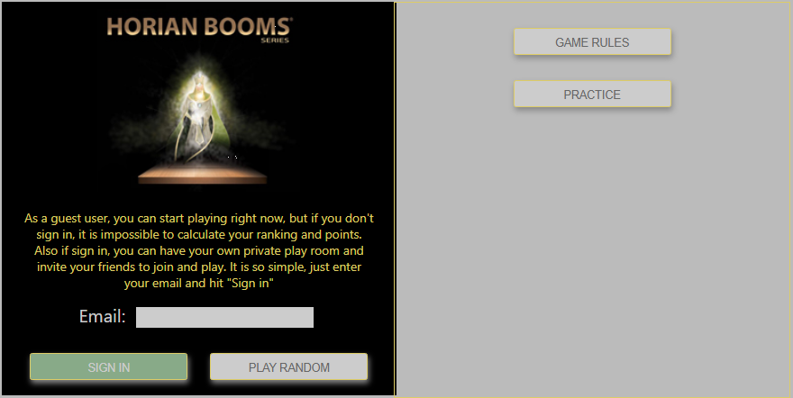
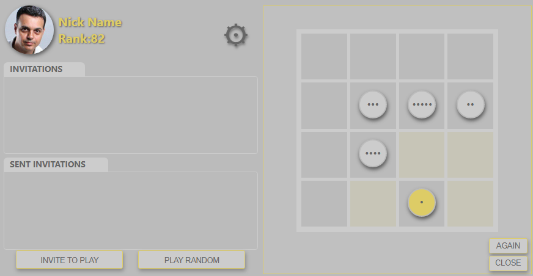
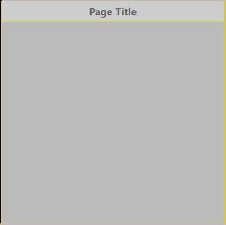
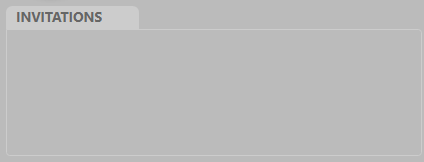

# FlowFive 

### An online multi user chat and play web app to play FlowFive board game with friends. 
---
 

  

## About the game

**FlowFive** is a minimal game from  **[Horian Booms](https://www.instagram.com/explore/tags/horianbooms/top/?hl=en)** family of mind battle minimal board games collection designed by Mehrdad Samia. All **[Horian Booms](https://www.instagram.com/explore/tags/horianbooms/top/?hl=en)** games use same platform and follow specific rules of design.

**FlowFive** online is a special adaptation of the game with ability ......... Original game design, rules, names and any related materials is done by myself. **FlowFive** is a member of my minimal game design collection **[Horian Booms](https://www.instagram.com/explore/tags/horianbooms/top/?hl=en)**

If you want to give it a try, you can go straight to *[Play FlowFive](https://samiamehrdad.github.io/FlowFive/)*, there is also a 'GAME RULES' and 'PRACTICE' section inside of the app that helps you to be familiar with the game !

 
---
## About this implementation
---
This instance of **FlowFive** is developed with a vision of simplicity and elegance. 

There is ...........

---
 

# Technical aspects
## Specified features 
There is some specifications about this implementation:
* No any 3rd party library or frameworks is used.
* All UI components are designed and developed for this project. 
* Following MVC software development pattern.
* Responsive design, mobile first.
* Keeping files size and network requests as low as possible.
* Browser compatibility tested by [BrowserStac](https://www.browserstack.com/)

## Technology

This project is a **MERN full stack web application.**
* **[MongoDB](https://www.mongodb.com/)**  A cross-platform NoSQL database program.
* **[Express](https://www.expressjs.com/)** A back end web application framework for Node.js
* **[React](https://www.react.org/)** An open-source, front end, JavaScript library for building user interfaces.
* **[Node.js](https://www.nodejs.org/)** An open-source, cross-platform, back-end JavaScript runtime environment

Final product is hosted by
* **[Heruko](https://www.heroku.com/)**  A cloud platform as a service
* **[MongoDB atlas](https://www.mongodb.com/)**  The Cloud-Native Database

## Special components

Some special React components are developed for this project, while I've tried to keep their design flexible enough, so they can be used as a general component in other projects. Below you can find e brief description of them ( Gaming special components like Boardgame, Boardcell and Gamepiece are not listed because they are not general purpose components)  

  **Styling note:**
  
  To keep UI design appearance consist, all components use some common styling variables, specially five CSS custom properties as main theme colors:
  
  * Theme colors
    * var( --back )
    * var( --dark )
    * var( --light )
    * var( --gold )
 
 All there is just four colors. They are useful to keep consistency, also implementing theme changing and dark mode as well.    

**Components:**

* TitleDiv >       A full screen container with custom title.  

 

*Properties:*
    
    - Title : A title string
    - Width: (optional) if ignored, component will adjust itself to 95% of containing parent.

      * Note: This component will automatically adjust it's height to its container, and its inner content is vertical scrollable. *

* LableDiv >       A panel with custom title. 

  

*Properties:*
    
    - Title : A label title
    - Width: (optional) if ignored, component will adjust itself to 95% of containing element
    - Height: (optional) if ignored, component will adjust itself to keep showing all of inner elements. *Note: If Height defined, then this component will be auto-scroll* 

* TimerBar >        A time indicating with live text and progress bar 

*Properties:*
    
    - Time : Time value in seconds. If set to 0, then TimerBar will show 'WAIT...'
    - Width: (optional) width of progress bar. if ignored, it will adjust itself to right end of containing element
    * Note: Time will be displayed with one decimal point. *  

* UserInfo       An informational panel

*Properties:*
    
    - user : This component extract information from user object and display them.
     user object should has .avatar( a url to user image ), .nickname and .ranking values.

* WaitingPlayer >    A chat bar that shows low contrast image user and a chat prompt.

*Properties:*
    
    - User : user object should has .avatar( a url to user image ) and a .chat value.
    * Note: .chat value is in track hook and each new value will trigger this component to re-render and show new message. *
    * Note: This component uses <AnimSpan> component to show message with typewriting animation effect. * 

* GuestBar >   A single line info bar that that can be add or remove easily.

*Properties:*
    
    - User : user object should has .avatar( a url to user image ) and a .nickname  value.
    * Note: Close icon (Red cross) lifts up state to the container parent. *

## Next steps :
* Implementing two sub version of FlowFive, Trade mode and Blind mode.
* Implementing tournaments and playing room with audiences.
* Making system owner and manager functionalities.
* Adding some ....
* Adding some ...
  
## Copyrights :
---
All graphics, layout designs and necessary images are created by myself.
All other components or plugins may be used in this project are open source MIT licensed pieces of software, that original rights belongs to it creators. 